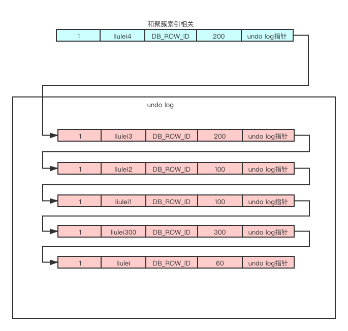
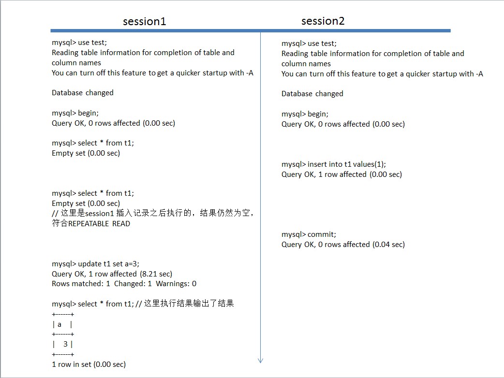
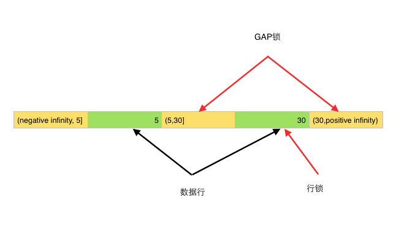

### MVCC原理
Multi-Version Concurrency Control,翻译为中文即多版本并发控制，使用它来实现RR以及RC隔离级别下读取数据的隔离性。串行话可以理解为直接用锁，而读未提交可以理解成什么也不控制。
    
    innodb为每一行记录都实现了三个隐藏字段
    DB_ROW_ID 6个字节: 行标识
    DB_TRX_ID   6个字节：删除、插入或者更新行的最后一个事物id，自动增长
    DB_ROLL_PTR 7个字节：回滚指针
    
|  #transaction 100   | #transaction 200  | #transaction 300  | #select 1  | #select 2  |
|  ----  | ----  |----  |----  |----  |
| bengin  | bengin | bengin |
| update test set cl = '123' where id =1;  |
|  | update test set cl = '123' where id =1; |
| | | update account set name = 'lilei300' where id =1; |
| | | commit; |
| | | | select name from account where id=1;       readview[100,200] 300 --> lilei300 |
| update account set name = 'lilei1' where id =1; |
| update account set name = 'lilei2' where id =1; |
| | | | select name from account where id=1;       readview[100,200] 300 --> lilei300 |
| commit; | update account set name = 'lilei3' where id =1; |
|  | update account set name = 'lilei4' where id =1; |
| | | | select name from account where id=1;       readview[100,200] 300 --> lilei300 | select name from account where id=1;       readview[200] 300 --> lilei2 |
|  | commit; |
    

操作的时候会生成事务id  
①每条记录都会拼接trx_id（事务id）和roll_pointer(回滚指针)2个字段  
②每次操作会将就数据移动到undo log，修改后数据的回滚指针，指向undo log中这条数据

查询的时候会读取出ReadView（一致性视图）：【未提交的事务id】数组+已创建的最大事务id  
可重复读，会在事物中第一次读数据时生成readview  
读已提交，会在事务中每次读取数据时生成readview

匹配规则：  
1.当表中数据事务id < readview未提交事务最小值，数据可见  
2.当表中数据事务id  >  readview最大事务id，说明本次事务开启时，表中数据事务都还没开启。 数据不可见  
3.当表中数据事务id in readview未提交数组里，说明这个事务还未提交，不可见。 特殊的：如果事务是当前事务，依旧可见  
4.当表中数据事务id > readview未提交数组里 || 当表中数据事务id < readview已创建的最大事务id 可见

删除算修改的一种特殊情况，会在undo log 的record header中记录下delete flag，如果被删除了，就忽略这条数据。  

### MVCC & 2PL解决了部分幻读问题
    主要参考https://www.zhihu.com/question/372905832，分别讲了MVCC和2PL（悲观锁，对应还有OCC乐观锁）解决的幻读问题
    ps：幻读主要在insert，不可重复读主要在delete & update

#### MVCC解决的幻读
阿里：http://mysql.taobao.org/monthly/2017/06/07/，这边文章是以mysql可重复度解决了幻读，但此情况还是出现了幻读的角度。我们反过来看mysql是如何通过MVCC解决部分幻读的  

  

在这个案例中。如果mysql的可重复读不解决幻读问题。哪session1在第二次select中应该是可以查出session2插入的数据的。但是由于MVCC的存在，session2的事务id是大于session1中readview的最大事务的，所以我们是看不到session2插入的数据的，保证了此时的不可幻读。但是记住MVCC只是解决读问题。在update时 讲session2插入的数据的事务id更新成seesion1的事务id了，导致最后一次查询数据的事务id==当前事务id变成可见了。
 
#### 2PL解决部分幻读

美团：https://tech.meituan.com/2014/08/20/innodb-lock.html  
 
  
 
以我们的认知可重复不解决幻读问题，此时事务B的数据应该是能插入的，但实际上被阻塞了，这是因为事务A在执行update的时候加上了间隙锁  
  
  
导致此时无法插入，需等事务A提交后释放锁（2PL第二步）才能插入。